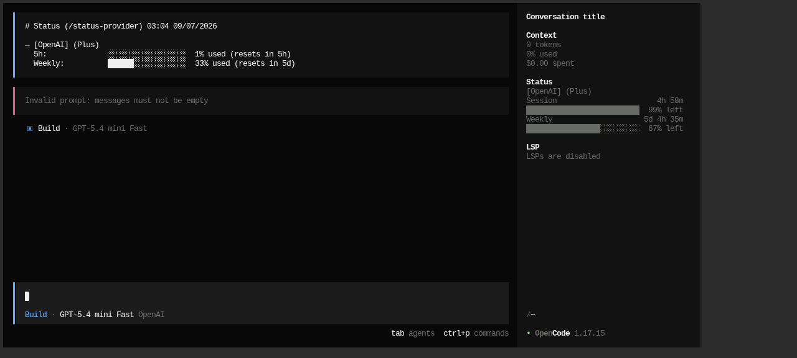

# status-provider

OpenCode plugin and CLI for provider usage status across AI providers.

`status-provider` renders quota/status windows in OpenCode popups, TUI sidebar panels, compact status surfaces, slash commands, and CLI output. It supports configurable provider ordering, display variants, session token summaries, pricing diagnostics, and provider-specific availability checks.

## Install

### npm

```bash
npx status-provider init
```

### Bun

```bash
bun add -g status-provider
status-provider init
```

### Local dev

```bash
bun install
bun run build
```

### Inside container

Use this when working from `plugin-status-provider`:

```bash
bun /plugin/status-provider/dist/bin/status-provider.js config
```

## Quick start

```bash
status-provider init
status-provider show
status-provider config
```

Then open OpenCode and use:

- `/status-provider` — inject a provider status glance into chat
- `/status-provider-toast` — force-show the popup toast now
- `/status-provider-info` — diagnostics, pricing, config paths, and provider availability

## CLI

```bash
status-provider --help
status-provider init
status-provider show [--provider <provider-id>]
status-provider config [--dry-run]
```

## Configuration

Primary config path:

```text
<config-root>/status-provider/config.json
```

`config-root` follows OpenCode config resolution. If `OPENCODE_CONFIG_DIR` is set, that directory is used as the root.

The config wizard can build a starting point for both sidebar and toast styling:

```bash
status-provider config
```

Example config:

```json
{
  "enabledProviders": "auto",
  "formatStyle": "allWindows",
  "percentDisplayMode": "used",
  "textVariant": "default",
  "providerNameVariant": "full",
  "percentVariant": "both",
  "colorVariant": "none",
  "alignmentVariant": "left",
  "toastTextVariant": "default",
  "toastProviderNameVariant": "full",
  "toastPercentVariant": "both",
  "toastColorVariant": "none",
  "toastAlignmentVariant": "left",
  "tuiSidebarPanel": {
    "enabled": true
  }
}
```

Sidebar + `/status-provider` output use `textVariant`, `providerNameVariant`, `percentVariant`, `colorVariant`, and `alignmentVariant`. Toasts use the `toast*` copies independently. `status-provider config` can copy sidebar choices into toast settings or let you tune them separately.

Clean-start policy: `status-provider` does not migrate legacy config automatically.

## Visual examples

TUI sidebar panel, `default` text variant (classic layout):



More variants (`minimal`, `box`, `emoji`, provider name styles, color modes) can be generated locally with `status-provider config`, which renders a live preview before saving.

## Development

```bash
bun run typecheck
bun run build
bun run test
```

Tests run through Vitest via `bun run test`; do not use Bun's built-in test runner for this suite.

## Status

Initial independent release line: `0.1.x`.

This project is a clean-history successor derived from prior fork work, but it is maintained as an independent project with its own package identity, config path, commands, docs, and release policy.

## Publishing readiness

The package is prepared for npm/Bun publication as `status-provider`, with a single binary named `status-provider`.

## License

MIT
